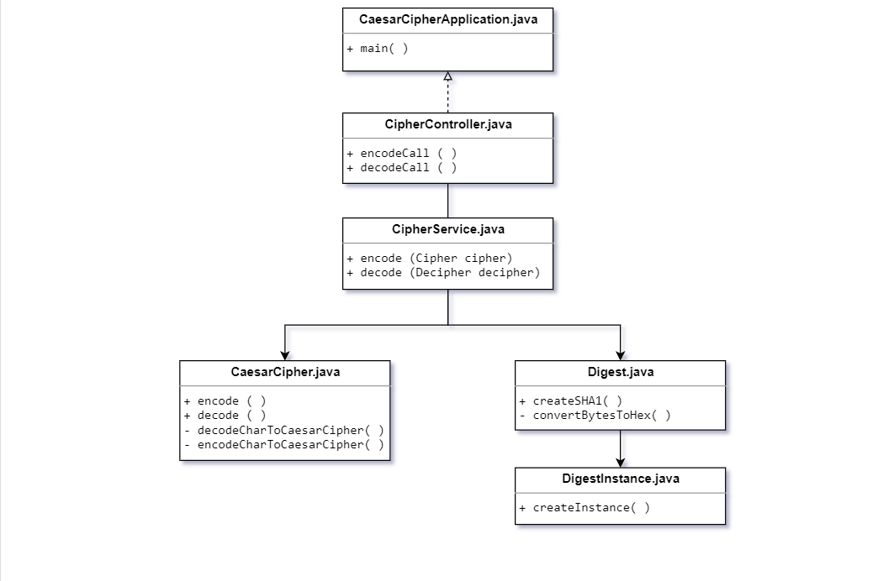

# java-caesar-cipher
Caesar Cipher

## Motivation

- reduce the complexity and workload of controllers. eg.: `onPress` is suitable for every button  
- reusability of components
- use of oriented-object and design pattern 

## Before start

Make sure the prerequisite list below is present on your environment
    
- [JAVA 8](https://www.java.com/en/download/) _(at least)_
- [Docker](https://www.docker.com/) _the latest stable version is recommended_
- [Maven](https://maven.apache.org/)
    - Follow the [Baeldung tutorial](https://www.baeldung.com/install-maven-on-windows-linux-mac) to configure the 
    environment variables properly 

## API Reference

Links below describes how the API endpoints are defined.

- [encode](.doc/encode.md)
- [decode](.doc/decode.md)

## Running (localhost)

- In the application root, run `mvn clean install` in order to generate the proper binaries. 

Once the above statement is completed, the `target` is folder now containing the `jar` file

- Still in the application root, run `docker-compose up --build`, and wait for the application deployment in docker.
 
By default, docker runs in `localhost`, anyhow check the `docker host` in
docker configuration

## Logs

## Class Diagram

